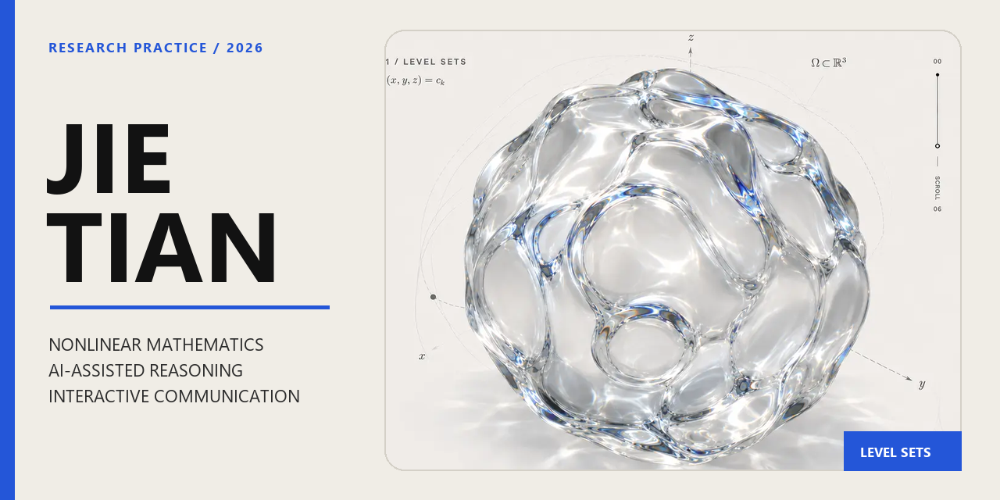

# Mathematics × AI for Research

A long-term personal lab for **nonlinear mathematics, AI-assisted scientific reasoning, and interactive research communication**.

**Live:** https://yns34-hub.github.io/

---

## Overview

This repository is the source of a research-oriented web space rather than a conventional developer portfolio. It connects three threads:

- **Mathematics** — nonlinear elliptic PDEs, Orlicz growth, rearrangement and comparison methods
- **AI-assisted research** — proof questioning, hidden-assumption checks, structured review workflows, human verification
- **Interactive communication** — research ideas expressed through restrained motion, WebGL, and information design

## Interface system

The site is built around an editorial layout with a small number of deliberate interactions:

- semantic single-page structure
- responsive typography and spacing system
- progressive section reveals
- interactive research-workflow component
- keyboard / reduced-motion considerations
- search and GitHub Pages support

## Nonlinear glass study

The hero object is a real **Three.js / WebGL2** surface, not a flat image distortion.

It uses displaced icosphere geometry, simplex-noise deformation, localized cavities, physical transmission materials, environment lighting, adaptive shadows, and real 360° pointer/touch rotation. The silhouette, highlights, reflection and refraction therefore change with the object itself.

## Stack

`HTML` · `CSS` · `JavaScript` · `Three.js` · `WebGL2` · `Vite` · `GitHub Pages`

## Repository map

```text
.
├── index.html        # semantic content and page structure
├── styles.css        # visual system and responsive layout
├── script.js         # navigation and interaction layer
├── sphere.js         # nonlinear geometry + glass renderer
├── assets/           # local assets and fallback poster
├── vendor/           # pinned browser-side Three.js runtime
├── docs/             # project notes and repository presentation
├── design-qa.md      # visual / interaction QA record
├── 404.html
├── robots.txt
└── sitemap.xml
```

## Local run

```bash
npm install
npm run dev
```

Verification build:

```bash
npm run build
```

## Working principle

> A convincing explanation is not the same as a proof.

AI is treated here as a second reader and exploratory instrument. Mathematical judgment, scope, assumptions, and final validation remain explicit.

## Archive

The previous graduation-memory version is preserved on:

```text
archive-before-academic-portfolio
```
