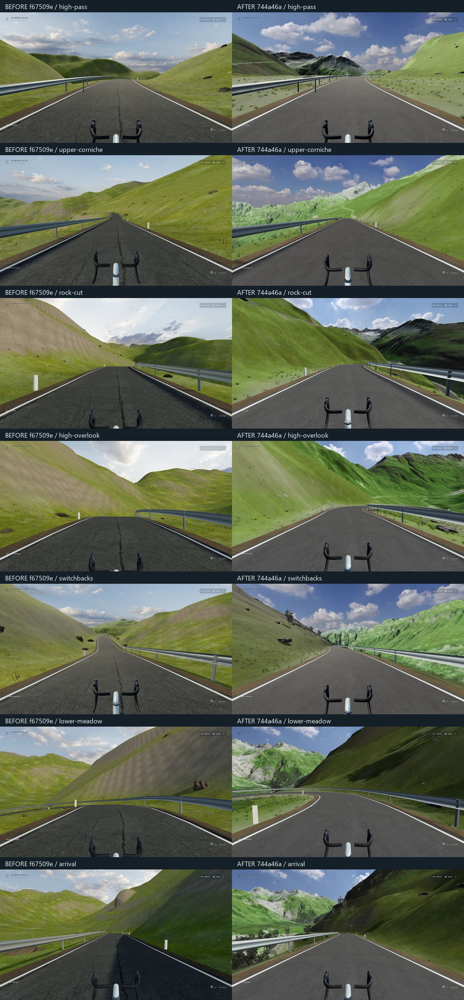

# 高山骑行画面精度更新

从 `codex/memory-palace-scenic-realism` 的 `f67509e1b663aa42197b41bf7099bafa6d0a0aac` 增量实施，分支为 `codex/memory-palace-alpine-fidelity`。场景实现固定在 `744a46ad61b14903acaec27089b78520849449ec`；其后的提交仅整理验收脚本、截图、文档与地图缩略预览。未自动合并或发布 GitHub Pages。

## 画面问题与实际改动

旧版低精度山脊、大面积重复草地、简化岩块与低分辨率天空共同造成软、空和重复的观感。本次不改博物馆结构，不增加新地图数量；集中改已有 `/alpine-ride/` 的可骑行地景。

- 山体换成 swisstopo 实测地形：原始资料为 2 m swissALTI3D；公开运行数据分别为远景 **10 m** 和路线附近 **4 m**。网格局部细分负责道路衔接，不宣称拥有额外测量精度。保留 19.2 × 15.2 km 的真实尺度。
- 地表有地理位置对应的 SWISSIMAGE 航拍底色，近、远图分级混合；近处使用 2K 草地、岩石和柏油 PBR 材质。岩壁使用三平面采样，避免垂直面拉长草地纹理。
- 路边岩石改成真实扫描模型的受控 LOD；草叶采用三簇真实曲面与透明照片，不再用细碎裸茎或带矩形底色的草图。92 m 内绘制详细叶片，60–85 m 与低成本完整草簇交接。风只更新 shader uniform。
- 天空观看背景为 **8K**，光照仍为 2K HDR / 一次 PMREM。背景和光照分开，避免用巨大环境反射目标获得云层清晰度。
- 实测地形预计算 20 m 太阳可见度，补充远山之间的遮光；仅削减直射光，保留天空与反射补光。距离雾和天空补光保留背光细节，拉开远近山坡。路面、植被、岩石和建筑的既有材质 shader 原样调用后才加入此层。没有新增实时阴影相机、镜面或全屏后处理。
- 道路的水平弯道、地图 ID、独立存档、车辆、第一人称操控、音乐/歌词、照片模式、Cinema 返回与隐私流程保留。道路高度贴合新高程，地形和路边物体使用同一地面查询。

主要文件：`src/worlds/alpine/{assets,route,terrainMesh,Geography,Scans,Grass,Vegetation,Landscape,Environment,sunlight}`。原 `src/worlds/road` 场景与物理代码保持基线；仅在既有 Ride options 添加数据来源说明。原博物馆、播放器、歌词、导入、字体与身份系统没有实现差异。

来源、许可与离线准备见 [SOURCES.md](../../public/media/alpine/SOURCES.md)。运行时不访问地理数据或素材服务。公开资源含必要的 **© swisstopo** 与 **© OpenStreetMap contributors** 说明；Poly Haven 源素材为 CC0。没有复制视频帧、游戏模型、音轨或私人音乐。

用户视频具体地点仍未独立确认；本路线采用 Furka Pass → Gletsch 数据，参考其道路构图、草甸、灰色山壁和深谷气氛。不是视频的逐景或资产复刻。

## 实际画面与操作验收



左侧为干净 `f67509e` 的本次启动实拍，右侧为新实现。七个固定路线比例、相同朝向、1920 × 1080、DPR 1、中等画质、空私人素材 fixture；上车使用原生输入。因道路高程修正，相机绝对高度与少量弧长位置存在调整；没有为了对照人为移动作品或地形。对照仅缩小截图，不重绘、调色或移除 UI。

新版本另有相同七个地点的 2560 × 1440 截图与照片状态，见 [1440p 组合](evidence/alpine-1440-contact.webp)。本轮没有 1440p 的旧版实拍，不能将其称为 1440p 前后对照。两种尺寸均实际查看；原始 PNG 留在本地 `outputs/alpine-fidelity/release-final/`，仓库保存高质量 WebP 和 [地点记录](evidence/alpine-captures.json)。

公共生产构建的原生键鼠检查分别记录在 [高山地图](evidence/alpine-native.json) 与 [原森林地图](evidence/forest-native.json)。覆盖步行接近、上车、踩踏/滑行、换挡、制动、实际 PNG 下载、Guide/音乐面板的 ESC 层级、刷新、两图独立进度和返回博物馆。截图和录像由独立浏览器、空私人素材 fixture 获得，不读取用户登录浏览器或私人库。

高山地图 **8 项**、原森林地图 **7 项**均通过，浏览器错误为零。本地原生录像分别位于 `outputs/alpine-fidelity/production-release/` 与 `forest-release/`，不混用截图脚本与硬件成绩。自查未发现需要替换受保护系统的问题；两张地图及全馆原实现的差异已核对。

运行验证：TypeScript、ESLint、26 个文件 / **133 项单元测试**。新增测试检查高程完整性与边界、道路一致性、地理 UV 精度、远距离道路搜索、地形块接缝和太阳可见度 shader 的非破坏插入点。公共 build 和私人内容排除结果见 [隐私检查](evidence/public-privacy.json)。

```powershell
npx tsc -b
npm run lint
npm test -- --maxWorkers=2
npm run build:public
node scripts/check-alpine-public.mjs
# 公共 dist 已固定；随后只恢复本机私人预览：
npm run media:register
```

## GTX 1650 实测与具体边界

Windows，可见 Edge **148.0.3967.70**，实际 WebGL renderer 为 ANGLE / **NVIDIA GeForce GTX 1650 / D3D11**；1920 × 1080、DPR 1、中等画质。使用 Vite dev 与原有只读诊断，公共生产流程另测。静止/滑行样本 6 秒，两段原生踩踏各 20 秒。完整数据见 [performance.json](evidence/performance.json)。这不是无头或 SwiftShader 的硬件成绩。

| 地点 / 状态 | 平均 FPS | p95 ms | 最长单帧 ms |
| --- | ---: | ---: | ---: |
| 山口 / 静止 | 140.4 | 7.1 | 34.7 |
| 沿山公路 / 静止 | 140.5 | 7.1 | 34.4 |
| 沿山公路 / 原生踩踏 | 141.3 | 7.1 | 48.6 |
| 沿山公路 / 滑行 | 128.1 | 13.9 | 76.4 |
| 回头弯 / 静止 | 136.4 | 7.6 | 41.7 |
| 回头弯 / 原生踩踏 | 136.1 | 7.2 | 124.9 |
| 回头弯 / 滑行 | 140.2 | 7.1 | 34.7 |
| 谷底 / 静止 | 140.6 | 7.1 | 41.7 |
| 返回 Worlds 翼 | 143.2 | 7.1 | 20.8 |

高山主渲染通道峰值 **144 calls / 263.8 万三角形 / 43 renderer 纹理 / 2 盏灯**。材质与自定义采样器图像估计 **258.5 MiB**；8K 背景按 RGBA+mip 估算另约 170.7 MiB，不等于完整 VRAM，未测 GPU timestamp 或所有环境目标的总显存。renderer.info 的主通道计数不包含额外阴影通道。退出后回到 30 calls、3032 三角形、12 纹理，未发现持续增长。

仍有明确限制：

- 四次新页面准备耗时 **13.6–15.4 秒**，包含解码、网格构建与材质准备；不能称为瞬时加载。
- 跨段最长记录 **124.9 ms**，仍有偶发停顿；平均 FPS 不能掩盖这一点。
- 远处岩壁仍是实测高程网格加航拍/材质，不是完整摄影测量山壁；建筑与远处植被细节仍低于参考影片中的游戏画面。不能称为摄影级或一比一还原。
- 整条约 10 km 路线做了物理仿真测试，原生操作与硬件测试为代表性局部路段，尚未完成全程连续硬件长测。2560 × 1440 本轮仅检查画面和布局，未做硬件性能认证。

本地开发预览 `http://127.0.0.1:5190/alpine-ride/`；公共生产预览 `http://127.0.0.1:5191/alpine-ride/`。二者只在运行此仓库的本机可用。原森林湖谷入口 `/cycling/` 保留。

## 可分别撤回的实现提交

- `10ba9f4`：实测高程、航拍及扫描素材与许可。
- `d5c75c6`：地形分层、真实植被和岩石呈现。
- `174cf27`：近景草叶预算、道路索引和地形准备优化。
- `287702d`：8K 观看天空与实测山体遮光。
- `744a46a`：背光可读性与距离空气层次。

最后的验收提交保存对照图、生产操作与硬件数据，并更新实际地图照片缩略图；PR #18 仍是原检查点。
