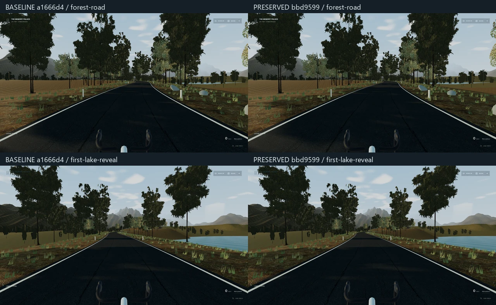
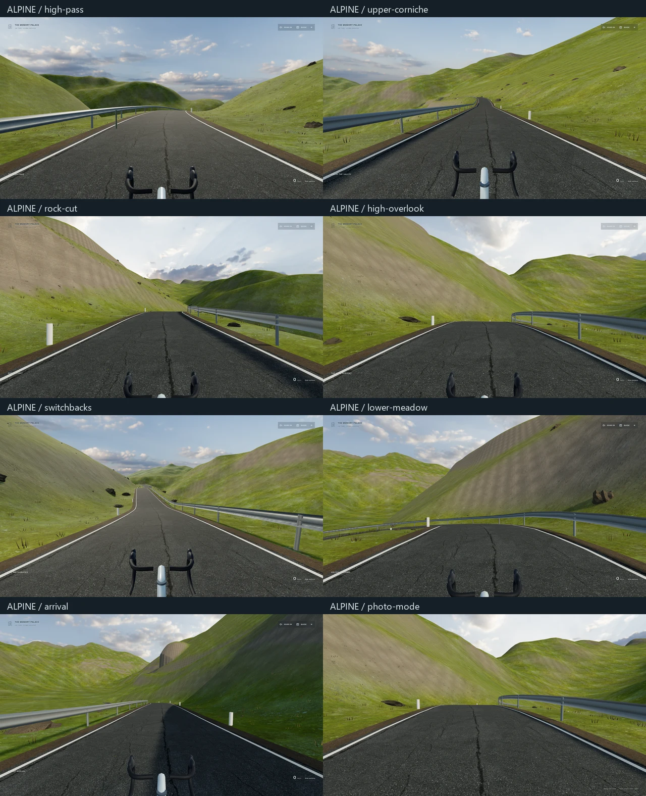

# 独立高山骑行地图

基线是 `codex/memory-palace-living-world` 的 `a1666d4c39505b65503e6e9f97aae1c067be06ad`。本轮在 `codex/memory-palace-scenic-realism` 增加 `/alpine-ride/`，保留 `/cycling/` 的森林、湖谷、路线与气氛实现，不替换地图，也不调整博物馆主体、音乐播放器、歌词或 IndexedDB 数据结构。

## 进入与操作

Worlds 翼新增 **THE ALPINE DESCENT** 入口。原骑行入口仍进入 **THE LONG WAY HOME**。两张地图的入口和 Ride options 都提供地图选择；正在行进时需先制动停车。存档独立保存：原地图使用 `memory-palace:road:v2`，高山地图使用 `memory-palace:alpine:v1`。

高山地图约 10.17 km，经过山口、沿山公路、石壁、长下坡、回头弯与谷底，包含三个观景停点。两图共用已验证的弯把公路车、踩踏/滑行、Q/E 换挡、S/Space 制动、P 照片模式、舒适度选项和环境音。刷新后恢复本地图进度，以静止步行状态重新进入。

## 场景依据与边界

已查看用户指定的 [Bilibili 视频](https://www.bilibili.com/video/BV1Tu4y187zN/) 的多个时间点：主要参考草甸与灰色山壁、深谷、护栏、白色路缘线、急弯和开阔山景。视频具体地点未确认；本地图以 **Furka Pass → Gletsch** 的开放地理资料建立独立第一人称路线，并不宣称是视频的精确地点或逐景复制。

- 地形来自 Tilezen Terrain Tiles 中的 Copernicus EU-DEM；约 19.2 × 15.2 km、50 m 网格，维持米制水平与垂直尺度。路边自适应细化只用于路基衔接，不增加地形测量精度。
- 公路中心线来自 OpenStreetMap，保持实际弯道；高度平滑与限坡用于消除 DEM 噪声，不是导航数据。
- 草地、岩石、柏油与天空使用有来源的 CC0 材质/HDR。坡度混合、远近尺度采样与三向投影控制铺贴感；路边岩石、路标、护栏和少量房屋为原创代码构件。
- 六段以内路边细节常驻、实例化草叶和岩石、单盏阴影主光、一次 PMREM；无全屏后处理、粒子场或实时镜面。

没有提交视频、视频帧、游戏模型、商业音频或私人收藏。许可证和可复现资产准备方式见 [来源记录](../../public/media/alpine/SOURCES.md) 与 [道路数据许可](../../src/worlds/alpine/ROAD-DATA-LICENSE.md)。

## 主要修改

- `src/worlds/alpine/`：独立地图、真实地形、PBR 材质、光照和离线道路数据。
- `src/worlds/road/mapTypes.ts`、`maps.ts`：地图描述；原体验通过局部参数读取地图，不增加第二套骑行状态或音频引擎。
- 原 `road/Experience.tsx`、`RoadBike.tsx`、`physics.ts`、`state.ts`、`Hud.tsx`：默认仍为原地图，新增长度/采样/地面参数、地图存档和选择入口。
- Worlds 边界、预加载与房间内容：按需加载新目的地，保留原门槛流程和稳定 URL。

## 验证方式

```powershell
npm test -- --maxWorkers=2
npx tsc -b
npm run lint
npm run build:public
# 公共 dist 不含私有音乐、歌词、HTML 或私人 manifest 条目。
# 构建后恢复本机私人预览，不改变已生成的公共 dist：
npm run media:register

# 先启动相应的 dev 或 production preview，再运行：
node --experimental-strip-types scripts/capture-alpine-ride.mjs
node scripts/check-alpine-ride.mjs
node --experimental-strip-types scripts/measure-alpine-ride.mjs
```

浏览器检查使用独立无私人素材 fixture；实际接近车辆、上车、踩踏、换挡、停车、照片下载、Guide/音乐面板、刷新、两图切换和返回均通过原生鼠标/键盘完成。固定地点截图通过合法本地图存档设置视角；并非整条路线的连续骑行录像。性能脚本使用可见 Edge 窗口并确认 NVIDIA GTX 1650 renderer；截图用的 headless 浏览器不计作硬件成绩。

测试、视觉与性能记录见 `evidence/`；该目录只收录空私人素材 fixture 下的画面及诊断，不含参考视频或本地库。

## 最终代码与实测

实现提交：`bbd959951885e214377def2c8563c583716f2781`。

- TypeScript、ESLint、25 个测试文件 / **128 项测试**通过。新增测试覆盖整条高山路线物理仿真、限坡、分段预算、独立存档、旧存档兼容与地图对应的 Cinema 返回快照。
- `build:public` 通过：生成 66 个分享路径，原 `/cycling` 与旧入口保留。五类私人 manifest 数量均为零；公开 dist 无 MP3、FLAC、M4A、LRC、私人 HTML 或私人清单文件。
- 生产预览 `http://127.0.0.1:5191`：高山地图原生流程 **8 项通过**，浏览器错误为零，包含两张地图切换与独立进度。记录见 [新地图操作检查](evidence/alpine-native.json)。
- 同一公共生产预览上的原森林地图 **7 项原生流程通过**，包括步行接近、上车、踩踏/滑行、换挡、照片、音乐/Guide 的 ESC 层级和刷新恢复；记录见 [原地图操作检查](evidence/forest-native.json)。
- 原地图的 `Landscape.tsx`、`Environment.tsx`、`route.ts` 与 `a1666d4` 的内容摘要一致；同机位视觉对照见下图。





七个路线位置与照片状态分别在 1920 × 1080 和 2560 × 1440 截取，均使用中等画质、DPR 1 与空私人素材 fixture；已实际查看对照与逐处画面。第二组布局见 [1440p 截图组合](evidence/alpine-1440-contact.webp)，原始位置/骑姿参数见 [截图记录](evidence/alpine-captures.json)。检查中修正了铺贴纹理、重叠地表、路面穿出、护栏跨过邻近急弯以及陡坡松散石块的悬空感。

性能环境：Windows，可见 Edge `148.0.3967.70`，ANGLE / NVIDIA GeForce GTX 1650 / D3D11，1920 × 1080、DPR 1、中等画质，Vite dev 构建。地理位置通过本地图存档设置，上车和踩踏使用原生输入；每段记录 6–8 秒 RAF 墙钟帧时间，包含模拟开销。

| 路段 / 状态 | 平均 FPS | p95 ms | 最长单帧 ms |
| --- | ---: | ---: | ---: |
| 山口 / 静止 | 140.7 | 7.2 | 27.9 |
| 沿山公路 / 静止 | 132.6 | 13.8 | 41.8 |
| 沿山公路 / 踩踏 | 136.3 | 7.3 | 34.8 |
| 沿山公路 / 滑行 | 129.8 | 13.9 | 69.4 |
| 回头弯 / 静止 | 137.9 | 7.3 | 34.4 |
| 回头弯 / 踩踏 | 138.9 | 7.2 | 48.3 |
| 回头弯 / 滑行 | 132.0 | 13.9 | 34.7 |
| 谷底 / 静止 | 140.7 | 7.1 | 34.7 |
| 返回 Worlds 翼 | 143.6 | 7.1 | 13.9 |

高山场景主渲染通道约 57–68 draw calls，跨段峰值 101；约 116–128 万三角形、18–21 个 renderer 纹理、2 盏灯。材质图估计约 36.5 MiB，**不代表完整 VRAM**；draw calls 不包含阴影/离屏通道。退出后 Worlds 翼记录 30 calls、约 3032 个三角形与 12 个纹理。完整样本与测量范围见 [性能 JSON](evidence/performance.json)。

## 仍需区分的完成范围

这是开放地理数据与浏览器预算内的可骑行高山地图，尚未达到参考游戏的植被密度、摄影测量山壁与建筑细节；50 m DEM 的山脊仍较平滑。路线整体完成已做物理仿真测试，原生浏览器行进验证为局部路段；尚未完成整条 10 km 的连续目标硬件长测。性能短样本不能代表全程帧时间，流式路边细节仍可能产生单帧停顿。

远处公路切坡仍可见较规整的边缘，近景岩壁细节与谷底植被仍是后续真实性提升的具体薄弱处；本轮没有把这些画面称为摄影级还原。

本地预览可用；此分支未自动合并或发布 GitHub Pages。
