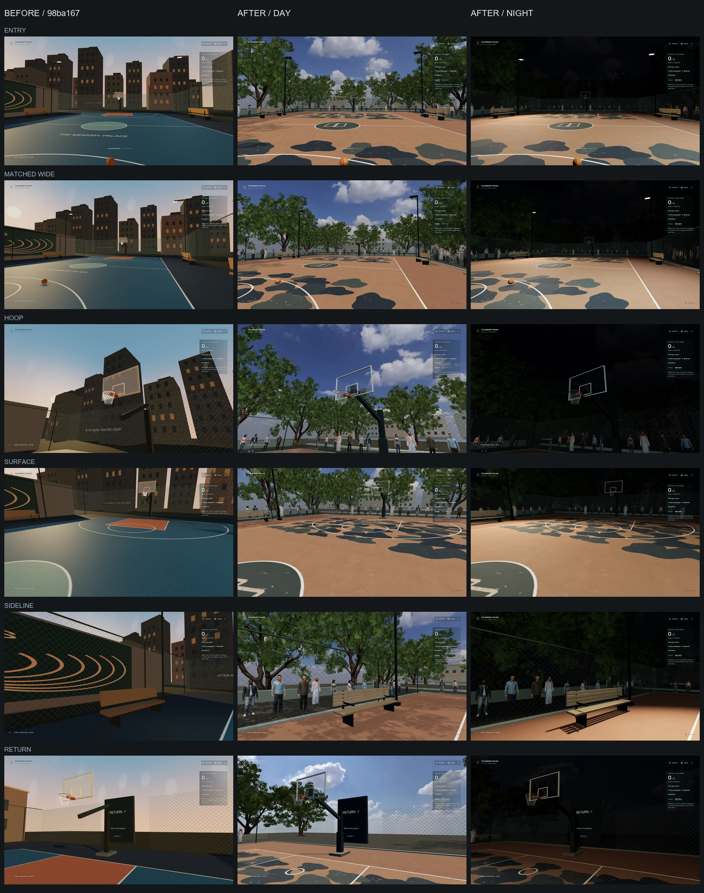

# 公园篮球场：昼夜画面与保留能力验收

从 codex/memory-palace-alpine-fidelity 的 98ba16749fe6e8bb05d48db2e072089e273e5d59 派生到 codex/memory-palace-court-fidelity。本轮只提高已有 /basketball/ 的环境与材质，保留自由练投。没有修改原分支、改写历史、自动合并或发布 GitHub Pages。

用户指定的 [Bilibili 视频 BV1P8tH6gEMM](https://www.bilibili.com/video/BV1P8tH6gEMM/) 已实际查看。提取的是树木包围的公园球场、铜棕色地面与深色有机图案、黑色围栏、旁观者及昼夜球场照明的视觉关系。公开资源不包含视频帧、游戏模型、官方标识或原声音轨。

## 实际改动

- 场地保持原尺寸、两侧篮筐位置、碰撞和出口。地面改为原创铜棕/炭灰绘画，叠加 2K 柏油颗粒、法线与粗糙度；边缘增加砖铺装和窄路缘。绘画坐标按真实场地长宽生成，没有拉伸网页或视频截图。
- 场外使用扫描树干/枝条、真实叶片照片构成的 19 株树，离线简化树干与枝条，冠层和木质部分实例化。修正原 glTF 重复 UV 和纹理方向；轻风只修改 shader uniform，减少动态时停止。
- 78 位旁观者来自六个 MIT 授权 Rocketbox 人物，采用离线烘焙静止姿态、512px 纹理和实例化。长椅、低矮背景建筑与围栏共同建立场外纵深。人物没有 AI 或对战行为。
- 篮板、支架、接头、护垫和细绳网补足实际连接关系，修正原支架方向产生的接合缝隙。篮框碰撞、篮板碰撞、进球网响应仍读取原物理事件。
- Daylight / Night lights 可切换，约 2.6 秒平滑交接并保存本机偏好。昼间天空补光与太阳、夜间冷暖两盏球场投光分工明确；转场后卸载零贡献灯。中等画质始终只有一盏主光生成阴影，没有增加全屏后处理或实时镜面。
- 篮板采用有界的双界面 Fresnel 薄平板光学近似，保留环境高光和正确透视透明轮廓；不是屏幕空间折射，也不是中庭厚玻璃的替代。中庭玻璃和材质代码保持基线。
- 准备层在异步材质释放后重新编译有效程序，仍等真实图片与着色器就绪。另修正首次曝光捕获及 Guide 直接进入时旧环境清理覆盖新 PMREM 的生命周期问题；没有跳过准备条件。
- Worlds 翼的旧预览路径使用新球场实际 3D 截图。路线、入口位置、馆标结构和字体没有重做；仅球场背景下增加相同馆标的轻微对比度适配。

主要实现文件：src/worlds/court 下的 Environment、Surface、Trees、Crowd、Park、assets、backboardGlass，以及原 CourtArchitecture。ActivityHud 增加昼夜控件；WorldWarmup / warmPrograms 修正资源准备。BasketballCourt 只插入资源预载门槛，没有替换 PracticeBall 或 basketballPhysics。

原馆 src/rooms、音乐/歌词 src/audio、素材/数据库 src/systems、Player、collision、馆标 Hud/primitives/palace.css，以及两张骑行地图 src/worlds/road 和 src/worlds/alpine，对基线没有实现差异。既有音频、导入、Cinema、房间与导航系统不归球场控制。

许可与离线准备见 [SOURCES.md](../../public/media/court/SOURCES.md)。Poly Haven 素材为 CC0，Rocketbox 保留 MIT 许可；公开球场资源约 18.5 MiB，复用既有 2K HDR。原始 FBX、视频、商业音乐及私人清单未进入 Git 或公开包。

## 同机位实际画面



每行按旧版、新版昼间、新版夜间排列。六个视角分别覆盖入口、宽景、篮架、地面、场边和返回入口。旧版取自本轮启动的 98ba167 实际运行画面；新版取自 a15d81b。相机位置、朝向、视口、DPR 1、中等画质和空私人素材 fixture 完全一致；照明刻意由旧版黄昏改为新昼夜，因此不声称是同光照对照。

2560 × 1440 也拍摄相同六个机位，见 [1440p 对照图](evidence/before-after-2560.webp)。两套对照及关键全分辨率原图均逐张实际查看，确认篮架连接、图像比例、地面关系、字体、昼夜暗部与出口。组合只缩小截图并加列名，没有重绘或调色。

相机和提交记录：[旧版](evidence/baseline-captures.json)、[新版](evidence/captures.json)。旧版 dirty 标记仅源于当时新增的截图工具；新版 dirty 标记仅源于待提交验收资料与实际球场缩略图，运行代码已提交。原始 12 张旧图、24 张新图留在本机 outputs/court-fidelity/before-matched 和 release-final。

[昼间全景](evidence/day-court.webp) · [夜间全景](evidence/night-court.webp)

## 操作、生产与隐私验证

- 1920 × 1080 和 2560 × 1440 的两次[原生操作旅程](evidence/native.json)通过：Worlds 实际入口、WASD、注视拾球、真实运球、计时投篮命中、投失、召回、Guide 暂停、单层 ESC、实际门槛返回。仅开始时声明相机机位布置，玩法由键鼠驱动，不注入进球结果或修改物理。
- [四项照明检查](evidence/lighting.json)通过：切灯时持球/运球/计数保持，刷新恢复夜间，减少动态立即落定，三次返回恢复馆内曝光 1 / far 200。连续重入资源数量保持 97 geometries / 53 textures，没有增长。
- [公开生产版五项检查](evidence/production.json)通过：真实公开清单及深链接，Guide 到篮球场的拾球/运球/投篮/辅助开关，缓存后重入及昼夜恢复，原森林骑行的上车/踩踏/制动/照片下载/刷新/返回，旧 /museum 入口与真实 Pointer Lock / 单次 ESC。不依赖生产调试导出，不操作用户已有浏览器。
- TypeScript、ESLint、27 文件 / 139 项单元测试通过。新增测试覆盖纹理重复与色彩空间、独立昼夜存储及被拒绝时降级、人物米制模型和资源边界、许可/素材排除、已释放着色器快照；既有音频、歌词、数据库与导航测试保留。
- build:public 通过，66 条分享路由和旧入口保持。[公开隐私检查](evidence/public-privacy.json)确认五类私人集合为空、无私有音频/LRC/HTML/个人清单或外部符号链接。公开 dist 固定之后只恢复开发版本机素材，未将私人音乐上传。现有三项本地音频标签读取警告仍存在，本轮不改私人歌曲文件。

常用操作：WASD 移动，E 拾球/运球，R 召回，按住 Space 或锁定视角时按住点击并松开投篮；准星指向任一篮筐。暂停与 Guide 沿用现有规则。昼夜按钮改变环境，不重置球或比分。

```powershell
npm run lint
npm test -- --maxWorkers=2
npm run build:public
# 另一个终端以 5191 预览 dist，以下不使用开发调试导出：
node scripts/check-worlds-production.mjs
node scripts/check-alpine-public.mjs
# 公开 dist 不再改动，恢复本机开发预览后检查：
npm run media:register
node scripts/check-court-lighting.mjs
node scripts/check-court-preservation.mjs
node scripts/capture-court-fidelity.mjs
```

## GTX 1650 短样本实测

Windows，可见 Edge 148.0.3967.70，实际 ANGLE / NVIDIA GeForce GTX 1650 / D3D11；1920 × 1080、DPR 1、中等画质、Vite dev。静止视角每段 8 秒，原生运球/走动与投篮每段 6 秒。完整结果见 [performance.json](evidence/performance.json)，来自 183f5a9；后续两项仅修正环境捕获/接管时序，没有改变该画面或 GPU 拓扑。生产操作另外验证，未把无头截图成绩当作硬件性能。

| 样本 | 平均 FPS | p95 ms | 最长帧 ms |
| --- | ---: | ---: | ---: |
| 昼间入口 | 120.4 | 14.0 | 55.5 |
| 昼间场边 | 131.4 | 13.9 | 41.6 |
| 昼间篮架 | 129.0 | 13.9 | 41.4 |
| 昼间运球行走 | 130.9 | 13.8 | 41.4 |
| 昼间投篮 | 127.1 | 13.9 | 34.7 |
| 夜间入口 | 122.1 | 13.9 | 41.6 |
| 夜间场边 | 123.4 | 14.0 | 41.6 |
| 夜间篮架 | 124.8 | 13.9 | 48.8 |
| 夜间运球行走 | 125.3 | 13.9 | 41.6 |
| 夜间投篮 | 124.6 | 13.9 | 34.7 |
| 夜间转昼间 | 117.5 | 14.1 | 41.7 |
| 返回 Worlds | 142.6 | 7.3 | 20.8 |

主通道峰值 96 calls / 112.55 万三角形 / 50 textures；转场样本最多 51 textures。昼间两盏灯、夜间三盏灯，其中一盏有阴影。renderer.info 的计数不包含阴影通道。材质/自定义采样器估计 213.16 MiB，4K 天空按 RGBA+mip 估算另约 42.67 MiB；不是实际总 VRAM，也没有 GPU 时间戳测量。返回 Worlds 后 30 calls / 3032 三角形 / 12 textures。

具体限制：新页面准备样本约 9 秒；最长样本帧 55.5 ms，仍有偶发停顿。六种人物实例重复且静止；长椅、低层城市背景及远处树冠仍是预算内简化。保留自由练投，没有增加 1v1 对手、完整竞技规则、2K 引擎或 DLSS；不能称为游戏画面的逐资产复制。1440p 仅检查画面和操作，未做该尺寸的显卡性能认证；长时间连续游戏性能尚未测。

本机开发预览 http://127.0.0.1:5190/basketball/，公开生产包本机预览 http://127.0.0.1:5191/basketball/；GitHub Pages 尚未部署。原 /cycling/、/alpine-ride/ 与馆内入口保留。

## 可分别撤回的提交

- 1ccd14b：授权扫描素材、原画地面与静止人物的离线准备。
- 232a1eb：材质替换后恢复有效着色器准备。
- ce2342d：树木公园、材质、旁观者与昼夜光照。
- 827aa87：枝条 UV 与有界薄平板近似。
- c5f7312：相同机位、真实键鼠和照明验证工具。
- 183f5a9：双界面反射在掠射角处保持有界。
- 4117e21：首帧前捕获外部曝光，返回时还原。
- a15d81b：公开 Guide 直接/缓存重入的环境接管与回归验证。

最后验收提交只整理实际图像、结果与预览缩略图；PR #19 和此前的馆内改造检查点仍可恢复。
