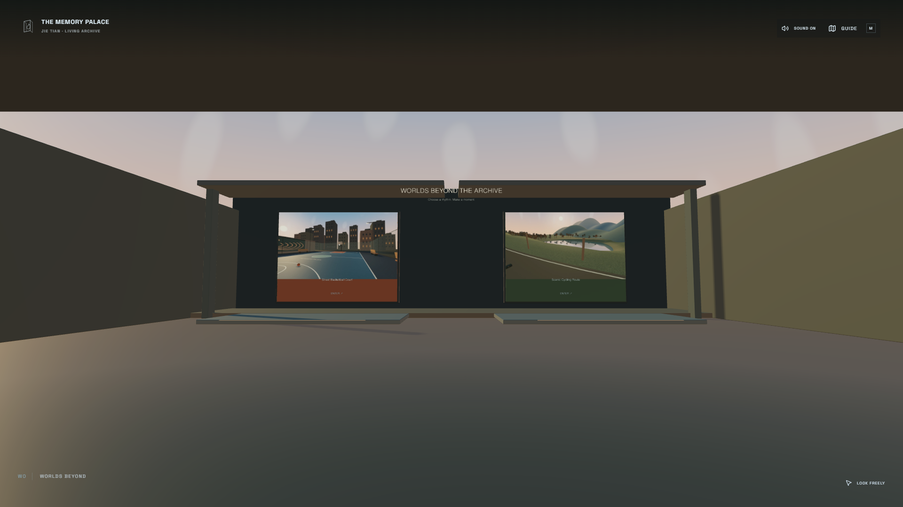
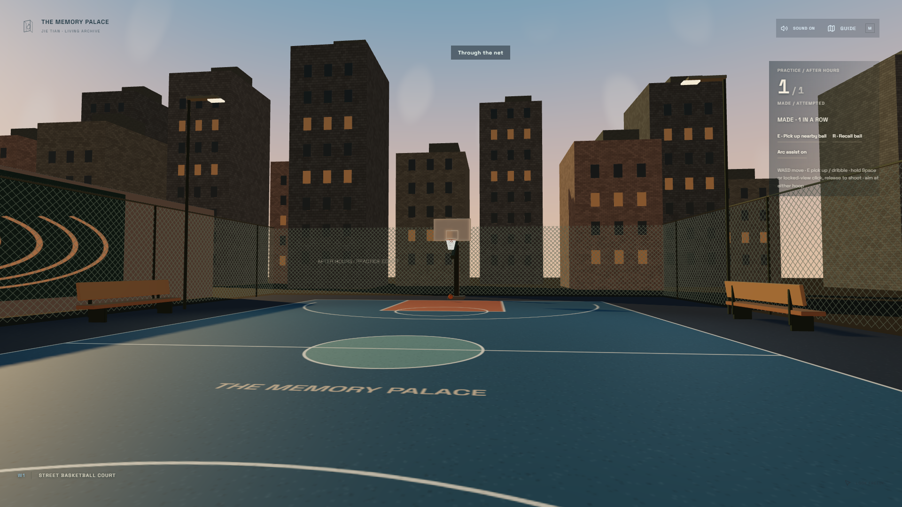
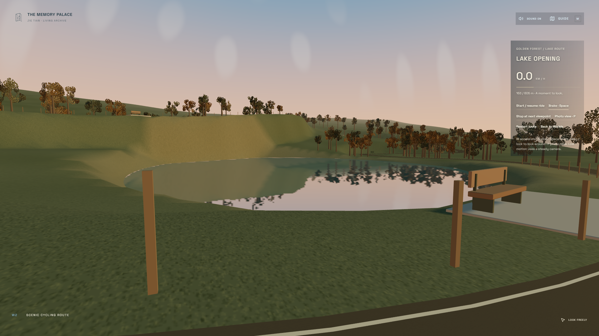

# Interaction worlds

Baseline: PR #13, `0e50661bcab27e0249ef57832599f14c740ab9c5`.
Branch: `codex/memory-palace-interaction-worlds`.
验收代码提交：`feb26c8eda883b41b212ad8a2a001e291eba7ef8`（之后仅提交本验收资料）。

本轮在现有世界上增加访问者交互与两个活动目的地。旧中庭、听音室、回廊、播放器、歌词、媒体库、Cinema 与私人素材隔离保留。

## 插入边界

- 交互注册表只拥有靠近/注视状态，不拥有音频、收藏、导航或文件。
- 展品继续调用原先的打开/收藏方法；注视不会自动打开或移动镜头。
- 一个 10 Hz 检查器读取世界坐标、实际遮挡和连续注视；每帧只更新局部材质/对象引用。
- 对 App、World、Player、collision 的扩展标记必须在测试白名单内。剥离新增插入块后，原源码仍须匹配 6380557 的固定摘要。原保护测试不改成新摘要。
- 新场景的状态、运动、输入和合成音效在独立目录；仅新路由激活。
- 不新增数据库版本、不删除任何导入记录、不上传本地文件。

## 分阶段验收

| 阶段 | 改动 | 证据 |
| --- | --- | --- |
| 1 | 连续注视/靠近基础层、输入门控、遮挡、提示与确认 | 3 个新增单测；保留摘要检查；同机位中庭/听音室 |
| 2 | 原展品的交互、播放器连续性、歌词观看反馈 | 81 单测；两种分辨率 8 项浏览器检查、12 帧；实际检查注视/收藏/歌词画面 |
| 3 | 街头篮球练习场 | 5 个物理单测；1080p / 1440p 两次完整原生操作旅程；真实命中、未中、返回截图 |
| 4 | 森林湖路骑行 | 5 个路径/制动/地形单测；1080p / 1440p 6 项检查；真实抵达三个停靠点、刷新恢复、原生看向湖面、照片下载、返回 |
| 5 | 集成、可访问性、公开构建、视觉/性能回归 | 99 单测 / 19 文件；原生生产浏览器 8 项、音频/歌词 5 项、活动/Pointer Lock 4 项；实机旧馆 21 样本、新世界 10 样本；38 张同机位比较 |

灵感参考：[Prompt Motion](https://www.prompt-motion.com/)。采用状态先后、文字遮罩揭示、同一对象在不同观看状态之间的连续运动；作品及素材不复制。

基线真实截图位于本地 `outputs/interaction-worlds/before/`，采用 1920×1080 / 2560×1440、medium、DPR 1、相同公开目录与原创本地 WAV/LRC 测试素材。

## 篮球练习

`/worlds` → `/basketball`。原中庭右侧新增一处入口，Guide 同时列出目的地。原有门槛行走与路由负责跨空间。

- WASD 行走；靠近球后 E 或点击拾取；再按 E 运球/握球。
- 朝向任一篮筐，按住 Space（或锁定视角后的鼠标左键）蓄力，松开投篮。约 64% 的释放窗口最稳定。
- Arc assist 可关闭；开启时只辅助朝向篮筐的真实弹道，时机失误仍改变落点。
- R 召回；计数显示当前练习的命中、出手、连中。离开后重新进入是新一次练习。
- 固定 120 Hz 的单球物理，每帧最多 12 步；落地、篮板、篮圈与向下穿圈分别产生真实事件。
- 篮板微光、篮圈/球网响应与合成音效由碰撞事件触发，不伪造命中。
- 音效复用原播放器的 AudioContext，遵循现有静音/环境音量，离开时释放；不改变曲目、FFT 或双槽播放。

验收发现并修正：关闭 Guide 后焦点返回按钮时，E 曾被过宽的输入排除规则忽略。E/F 现在只排除输入框和阅读区域，面板状态仍优先阻止世界操作。

## 森林湖路骑行

`/worlds` → `/cycling`。约 605 m 的闭合路线依次经过林间入口、湖面开口、山谷上坡、观景高处与返程树林。

- W / ↑ 加速，S / ↓ 慢行，Space 制动。按钮支持轻松巡航与刹车；不需要持续按键。
- Stop at next viewpoint 沿道路骑到下一处，并自动平缓制动；不会传送。
- 拖动或 Pointer Lock 环顾；P 进入静止照片模式，ESC 退出这一层。Save this view 只下载实际场景 PNG 到本机。
- 菜单、失焦和照片状态停止骑行。刷新后恢复距离，保持停止，由访问者决定继续。
- 低动态关闭 12 mm 的细微车身运动；低画质关闭湖面离屏反射。
- 中画质仅湖面使用 384×384 的单一反射视口；实际入镜时最多更新 8 Hz，离开场景释放。其他馆室不增加反射通道。

本阶段实际截图修正了道路三角形朝向、地形遮挡、树冠轮廓、车把位置与站台支脚。准备状态等待场景对象、关键纹理与原库就绪；新层的 React key 使用独立前缀，避免与原房间容器碰撞。

## 访问者交互与动效

靠近作品出现克制的四角反馈；连续注视 0.55 秒后才显示一个标题/操作提示。E 调用现有打开动作，F 调用现有收藏动作。真实遮挡、父组可见性、面板、阅读区域和输入框都会门控这些动作。操作完成后给一次短暂确认。靠近或注视不会自动打开作品、启动音乐或改变镜头。

Now Playing 的同一张真实封面在迷你播放器与原面板间进行 380 ms 连续过渡；切歌、离开、隐藏页面和低动态会取消临时元素。原播放器及其焦点、进度与双槽音频继续拥有状态。歌词只在原七行投影上增强注视层次，细线读取平滑后的真实 RMS；暂停自然归零，当前 LRC/嵌入歌词/校时/手动 TXT 管线保持原样。

新目的地沿原门槛导航进入。靠近入口先加载对应场景代码；下一场景等待关键资源与实际 GPU 程序就绪。新场景准备可被取消；隐藏的准备对象不接受注视。程序预热包含屏幕、线性输出与阴影变体；1×1 临时目标只用于编译，不绘制且立即释放。程序就绪轮询使用锁定的 Three r180 接口，升级 Three 时应重跑准备测试。CPU 纹理源只缓存八种原创画布（最多约 19 MiB），各挂载实例独立拥有/释放 GPU 纹理与 UV 设置。

参考 [Prompt Motion 的连续 UI 状态示例](https://www.prompt-motion.com/twoclipping-5cba86)：采用同一封面的连续过渡、文字分步揭示、操作后短确认与有先后关系的门槛显露。它们由真实操作触发；原有动效 tokens/低动态机制继续使用。没有复制该网站的视频、代码或素材。

## 主要文件与改动级别

| 位置 | 作用 | 级别 |
| --- | --- | --- |
| `src/interaction/` | 世界坐标靠近/注视、真实遮挡、输入门控、单一提示、封面连续性、原歌词观看反馈 | 1；局部 DOM 临时元素为 2 |
| `src/motion/WorkAttention.tsx`、`src/rooms/PersonalRooms.tsx` | 在原展品周围插入反馈与注册，继续调用原来的打开/收藏 | 1 |
| `src/worlds/` | 新活动场景、物理、低频 UI、门槛入口、原创材质、现有音频上下文内的环境音效、资源准备与释放 | 新增组件；不替换旧组件 |
| `src/App.tsx`、`src/world/World.tsx`、`Player.tsx`、`collision.ts` | 明确标记的少量插入块，仅新路由改变场景环境/范围/活动输入 | 1 |
| `content/rooms.json` | 追加三个稳定 ID：worlds、basketball、cycling | 内容扩展 |
| `scripts/check-*.mjs`、`tests/` | 真实浏览器旅程、物理/路径/音效/资源生命周期测试、原始保护检查 | 验证 |

没有 Level 3 旧组件重写。`src/audio/player.ts`、`lyrics.mjs`、`LyricsWall.tsx`、`spatialLyrics.ts`、`MusicPanel.tsx`、`Hud.tsx`、identity 与 library/store 的原有实现保留。原 33 个固定源码摘要和三个空间的 AST 检查继续通过；只对白名单中标记的新增插入块进行剥离，没有更新原摘要来掩盖重写。

## 实际验收

[机器可读结果](evidence/verification.json)保留各阶段的真实来源提交。旧馆对比采用 `0e50661` → `f3e09d0` 的 38 张实际截图；之后的空间构件变更限定于新增目的地。最终生产旅程使用 `feb26c8` 的 public build。少数早期阶段报告没有记录 SHA，结果中为 null，不补造版本。

| 检查 | 结果 |
| --- | --- |
| TypeScript、lint、public production build | PASS；67 个独立分享路由、53 个索引路由，旧入口保留 |
| 单元测试 | 99 PASS / 19 文件；包含真实射线验证地形三角形插值、球物理、制动/停靠、音效清理、GPU 原材质归属与取消准备 |
| 原馆空间/导入/收藏/Cinema/回廊/配乐阶段回归 | 12 PASS；五块有界回廊、精确返回、真实音频分析及原数据迁移 |
| 动效与馆标阶段回归 / 可访问性 | 10 PASS / 6 PASS；OS 与应用低动态、暂停、一次 ESC、原字号/字体/层级 |
| 展品与歌词交互 | 两种分辨率共 8 PASS；真实注视、遮挡、收藏和原歌词同步 |
| 新场景与跨场景播放 | 篮球 2 完整旅程、骑行 6 检查、集成 6 检查；1920×1080 与 2560×1440 |
| 三档准备、取消与往返 | 5 PASS；原生拾球/运球/踩踏可用，相机 far 恢复 200，三次重复退出不累积纹理 |
| 最终生产浏览器 / 音频歌词 / 活动 | 8 PASS / 5 PASS / 4 PASS；活动测试完全使用原生 UI/键盘，生产环境无开发调试导出 |
| 当前本地歌曲回归 | 38/38 可用音频原生播放通过；两槽、一槽实际播放；只提交匿名汇总，不包含曲名/路径/ID/录音 |
| 私人素材隔离 | public manifest 五个列表均为空，目录只有 manifest；没有私人音乐、LRC、HTML 或清单；本地注册恢复 |

通用生产浏览器脚本明确跳过一项依赖开发相机导出的精确碰撞/移动断言。它由开发旅程与单测覆盖；生产活动脚本另外验证了原 `/museum` 入口的真实 Pointer Lock 和一次 ESC。未把跳过项算作通过。浏览器旅程没有控制台/运行错误或 POST 上传请求。

## 实机性能与范围

Windows、安装版可见 Edge `148.0.3967.70`、NVIDIA GTX 1650、驱动 `32.0.15.9186`，1920×1080、DPR 1、medium。每项是 5–8 秒短样本；切换样本更长。采样真实 RAF 间隔，逐项确认 D3D11 使用 GTX 1650。截图/无头浏览器的计时不作为显卡成绩。

| 场景/动作 | 最终平均 FPS | p95 帧时间 |
| --- | ---: | ---: |
| 街球场静止 / 实际运球 / 实际投篮 | 108.8 / 142.2 / 133.9 | 14.0 / 7.1 / 7.3 ms |
| 骑行林间静止 / 加速 | 138.8 / 135.6 | 7.1 / 7.1 ms |
| 湖面入镜反射 / 低动态骑行 | 138.3 / 138.0 | 7.1 / 7.1 ms |
| Worlds 入口 / 多次退出后 | 143.1 / 142.7 | 7.1 / 7.1 ms |
| 听音室静止 / 真实播放、FFT、歌词 | 141.9 / 140.1 | 7.1 / 7.2 ms |
| 回廊静止 / 行走 / 分块连续加载 | 141.9 / 132.2 / 135.7 | 7.1 / 7.1 / 7.1 ms |
| 中庭静止 / 行走（完整样本集） | 64.0 / 74.2 | 20.8 / 20.7 ms |

完整旧馆 before/after 样本中，中庭分别为 70.8→64.0、79.5→74.2 FPS。追加的同条件相邻交替复测为 63.2→62.0、73.0→71.3 FPS，p95 约 20.8–20.9 ms。短测存在运行间差异，两个结果都保存，不只取较好的数字。其他主要展厅的最终静止样本约 142–143 FPS。原馆混合切换样本平均 82.8 FPS。

新世界混合切换平均 63.1 FPS、p95 20.7 ms，**最大帧间隔 3312.5 ms**：首次从户外进入尚未编译的原馆玻璃场景仍有长峰值。这是具体剩余问题，平均值达标不代表所有转场稳定。新场景程序准备降低了新场景的首次绘制停顿，未修改原馆材质与渲染器。

新场景最终计数：街球静止 104 calls / 22,940 triangles / 10 textures / 4 lights；林间骑行 63 calls / 235,516 triangles / 8 textures / 2 lights；湖面入镜 71 calls / 235,624 triangles。混合往返峰值 40 textures，回到 Worlds 后 14。纹理 map 估算分别约 25.1 / 7.1 / 17.8 MiB。计数是 renderer.info 的最终绘制计数，未合并全部离屏/阴影通道；map 估算不是总 VRAM，没有 GPU timer-query。

原始数据：[before](evidence/performance-before.json)、[after](evidence/performance-after.json)、[new worlds](evidence/performance-worlds.json)、[中庭交替 before](evidence/atrium-pair-before.json)、[中庭交替 after](evidence/atrium-pair-after.json)。未完成 1440p 性能、DPR 2、30 分钟热稳态与实体移动设备实测。

## 截图与预览

新场景为原创风格化建模与纹理，尚未达到写实游戏资产的美术细节密度。没有使用官方 NBA 标识、商业音乐或他人的游戏素材。当前包含可玩的自由投篮和完整骑行路线，不把截图称为写实渲染。

已逐张查看的同机位比较：[中庭](evidence/atrium-before-after.jpg)、[听音室/回廊](evidence/listening-corridor-before-after.jpg)、[展厅 A](evidence/exhibitions-a-before-after.jpg)、[展厅 B](evidence/exhibitions-b-before-after.jpg)、[展厅 C](evidence/exhibitions-c-before-after.jpg)、[1440p 布局](evidence/1440p-layout-before-after.jpg)。比较图仅缩放和增加标签，使用真实截图。

本地开发预览：`http://127.0.0.1:5190/worlds`；公开构建预览：`http://127.0.0.1:5191/worlds/`。尚未部署到 GitHub Pages，不改变主站入口，不自动合并 PR #13 或本分支。

复现：`npm ci`、`npm run lint`、`npm test`、`npm run build:public`；预览服务器使用 `npm run preview -- --port 5191`。各 `check-*.mjs` 通过 `PALACE_URL` 指定 URL、`PALACE_ARTIFACTS` 指定本地输出。私有音频批测仅在本机运行，公开 CI 不需要私人素材。

## 原子提交

| SHA | 修改 |
| --- | --- |
| `ec5f572` | 靠近/注视基础设施 |
| `378289b` | 展品、播放器与歌词连续性 |
| `6a8e1bd` | 街球场与真实投篮物理 |
| `3c64fb4` | 骑行路线与真实观景停靠 |
| `f3e09d0` | 原生输入、入口、遮挡与音效清理 |
| `5dc28b1` | 原创球场材质与围网尺度 |
| `1a4a193` | 原生旅程验证与真实场景预览图 |
| `6ca732a` | 原馆返回资产预热、速度/距离驱动的路面和水声 |
| `f51f4ed` | 可取消 GPU 程序准备、独立纹理归属与资源测试 |
| `591f62b` | 长椅靠背构造连接 |
| `feb26c8` | 实际地形附着与湖景视廊修正 |

后续验收资料提交只包含本文件与公开截图/匿名验证数据。每个功能阶段可独立撤销；PR #13 的分支与历史保留。
