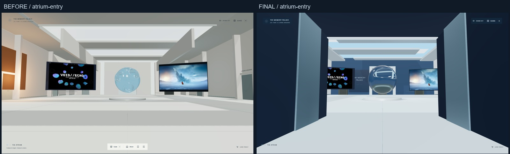
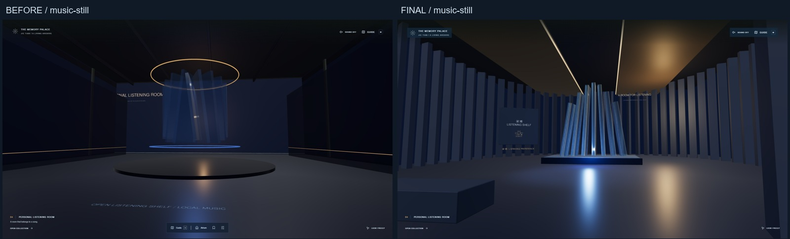
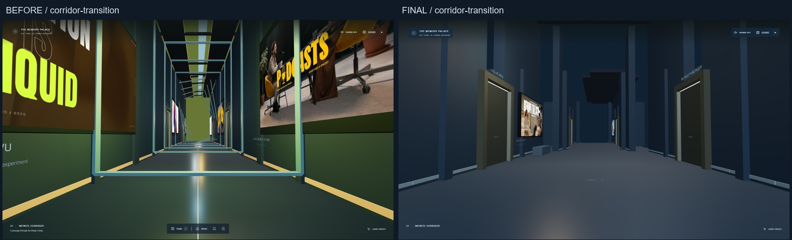
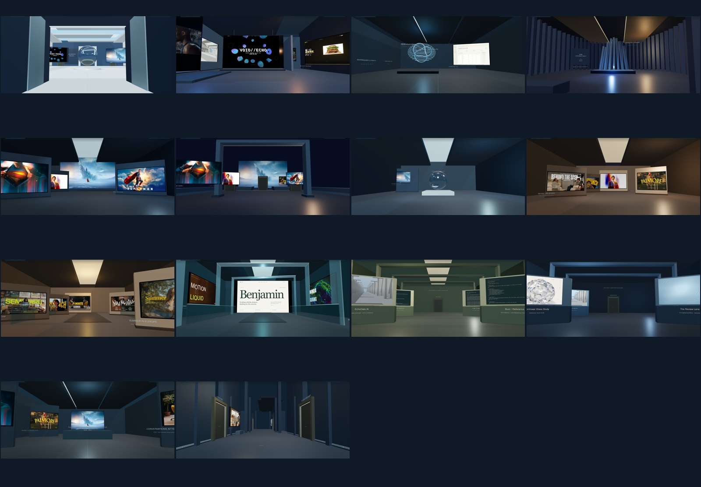

# Memory Palace — spatial quality refactor

基线：`0424eb679a2c8ba9f1b6fbe052a323f6a3f097f3`，包含 `f848676` 的 personal-world 内容。实施分支：`codex/memory-palace-quality-leap`。入口仍为 `/`；`/museum/` 跳转到当前入口，旧静态页面继续保留。没有修改 memory-palace-preview 快照。

中庭以低入口压缩视野，再打开白蓝高挑空间；闭合玻璃实体成为中景，真实项目、壁纸和琥珀色音乐门形成下一处兴趣点。靠近后可主动触发“记忆显影”，暂时呈现真实收藏或已有精选作品；保持原相机，可用 ESC 中断，减少动态模式以静止呈现成立。

聆听室采用弧形声学构件、七片有厚度的玻璃鳍片和偏离中轴的停留位置。实际 Web Audio 频段分别影响底部光照、鳍片微小开合与局部高光；暂停后平滑归零。曲名、歌手、封面来自当前歌曲；缺少标签时明确显示未知身份。现有本机播放、房间配乐与 crossfade 保留。

回廊保留稳定种子、地址与五段常驻；通道通过低窄段、挑空段、偏移光井、侧厅和断开的展墙改变横截面。−003 门根据真实访问次数，从初次内室转到更大内室；这是预算有限的状态式空间异常，未实现 portal 或非欧几何渲染。

| 空间 | 建筑与观看方式 |
| --- | --- |
| Projects | 非对称主展台、错位墙体、VOID//ECHO 主屏与不同尺度的次级项目 |
| Research | 三段屋顶、精确线性照明、保留数学与作者事实 |
| Wallpaper Vault | 按原图比例计算独立展墙、主次尺度与观看距离 |
| Cosmic / Imagined Worlds | 开放远景、前景框架、可步行悬桥与护栏；二维作品保持原比例 |
| Glass Life | 闭合玻璃实体为主，印刷图像用于参考 |
| Portraits / Editorial | 温润侧光、较近尺度；Editorial 使用偏移入口梁与不同展墙节奏 |
| Liquid Web | 玻璃门架与真实主预览；按需激活一个网页，关闭即卸载 |
| Archive / Unfinished | 落地资料索引、真实来源与阶段；收紧无效行走范围 |
| My Collection | 实际收藏决定陈列；图片与项目引用共享 ID，增减收藏后同步变化 |

图片分为 sRGB 发光屏幕、受限照明的摄影印刷品和短暂投影。`contain` 保持比例，`cover` 使用几何 UV 裁切并支持焦点。纹理按画质分级、共享引用计数，离开展厅不会销毁其他展位仍在使用的纹理。玻璃使用 PMREM 环境与实体折射；没有全馆实时镜面。

Guide → **Arrange / import works** 完成批量文件预览、标题、类别、目标房间和主展品确认，再到实际展位观看。失败项可单独重试；标题、目标房间、顺序、移除和恢复保存到现有 IndexedDB v1。旧 blob、ID 和收藏保留。影院退出恢复房间、位置、朝向及原二维分类；一个 ESC 只处理最上层状态。详情侧栏保留场景，打开后 WASD 暂停。

公开构建的 `personal-media/` 仅有空 manifest。本机歌曲、私有 HTML、私人清单与浏览器导入不会进入公开发布；公开版继续陈列已经公开的真实精选作品。网页不允许嵌入或未公开时保留真实截图与 SOURCE，不绕过限制。

## 同机位画面

2026-10-05，安装版 Edge 148.0.3967.70，实际 D3D11 renderer，medium、DPR 1。19 个机位在 1920×1080 和 2560×1440 各保存修改前后截图，共 38 组；另有玻璃侧面/背面、宇宙展区、真实播放、导入、观看和返回截图。已逐张查看两种尺寸的对比与主展区剪影。

左为基线，右为此次改动。修改后截图在基线 HEAD 上带工作树改动拍摄，原始 JSON 如实保留其 HEAD；本分支的提交包含所拍摄的实施内容。截图的 headless 帧率不用于硬件验收。









## 实际验证

| 检查 | 本机结果 |
| --- | --- |
| `npx tsc -b` | 通过 |
| `npm run lint` | 通过 |
| `npm test` | 9 个文件、62 项通过 |
| `npm run build:public` | 通过；64 个独立路由，50 个进入 sitemap |
| `npm run test:quality` | 12 项通过；v1 兼容、指定展厅导入、持久化、实体展位、影院原位返回、收藏增减、回廊内室、桥面碰撞、真实 FFT 与暂停归零 |
| 公共生产浏览器回归 | 10 项通过；旧入口、真实静态路由、无 JS 内容、2D 索引、媒体导入、全部主要房间与移动模拟降级 |
| 公共生产原生 Audio | 3 项通过；明确点击播放，同一个原生音频跨三间房持续播放 |
| 最终公共生产补查 | 5 项通过；`/museum/`、原生 Pointer Lock、分层 ESC、最终桥面/展翼与私人媒体排除 |

生产构建不导出开发相机，因此原来的生产相机坐标断言被明确跳过；对应的 WASD、桥面护栏、门洞返回和原位恢复在开发版 12 项流程及单元测试中验证。网页 iframe 的实际运行在本机私有 HTML 版本验证；公开版只暴露已公开预览和来源。

## 性能实测范围

本机 NVIDIA GeForce GTX 1650，驱动 32.0.15.9186，安装版 Edge、可见窗口、D3D11，1920×1080、DPR 1、medium。19 个静止/行走/跨房间采样，加两项最终宇宙平台补测，每项约 5–12 秒。原始数据：[主要采样](performance.json)、[最终远景补测](performance-observatory.json)。

主要采样平均 98.55–144.09 FPS，P95 帧间隔 7.1–14.0 ms；跨房间采样约 101.7 FPS。最大 draw calls 250、三角形 61,654、活动灯光 6、renderer 纹理 80；场景贴图未压缩尺寸估算最高 63.21 MiB，该估算不包含全部 GPU 内存和 render target。跨房间最高单帧间隔 340.1 ms，回廊流式行走最高 83.3 ms；切换和流式加载的尖峰尚未全部消除。最终 Imagined Worlds / Cosmic 补测平均 143.6 / 144.0 FPS。

记录来自 `requestAnimationFrame` 墙钟间隔、`renderer.info` 与场景统计，不是 GPU timer query。两项短时验收条件（平均 ≥45 FPS、P95 帧间隔 ≤22 ms）在这些采样中达到；不能推断所有 GTX 1650 机器或长时间运行都稳定。

尚未完成：消除所有切换 / 流式加载尖峰、30 分钟以上连续压力测试、2560×1440 / DPR 2 的可见窗口性能测试、实体手机实测。移动端仅做模拟浏览器中的 Tour / Index 可用性验证。状态式回廊内室没有 portal 渲染；玻璃环境没有高成本实时平面镜。外部受限网页及私有收藏的在线分享也不在本轮实现范围。

## 复现

```bash
npm ci
npm run dev -- --port 5190 --strictPort
# 在第二个终端运行
npm run test:quality
npm run qa:quality
npm run qa:performance
```

这些新脚本默认使用 Windows 安装版 Edge；其他系统通过 `PALACE_BROWSER` 指定浏览器。`PALACE_URL` / `PALACE_ARTIFACTS` 指定地址与输出。`PALACE_TEST_TRACK` 可选本机已有合法歌曲；默认流程通过本机导入 UI 使用仓库自制 Palace Study WAV，不下载商业音乐。没有私人 HTML 的版本会报告 iframe 激活未测，并验证真实截图与 SOURCE 回退。

公开生产验证先 `npm run build:public`，再 `npm run preview -- --port 5191 --strictPort`。`PALACE_URL=http://127.0.0.1:5191`、`PALACE_VERIFY_DIST=1` 配合 `npm run test:browser` 检查实际生成文件。结束后 `npm run media:register` 恢复本机开发收藏。主站发布仍由 main 的 GitHub Pages 工作流控制，分支 PR 不自动部署。
