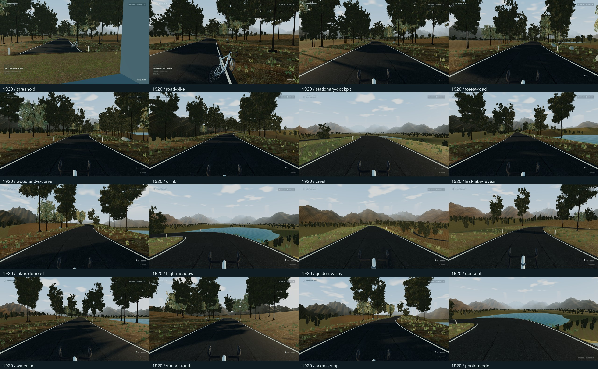
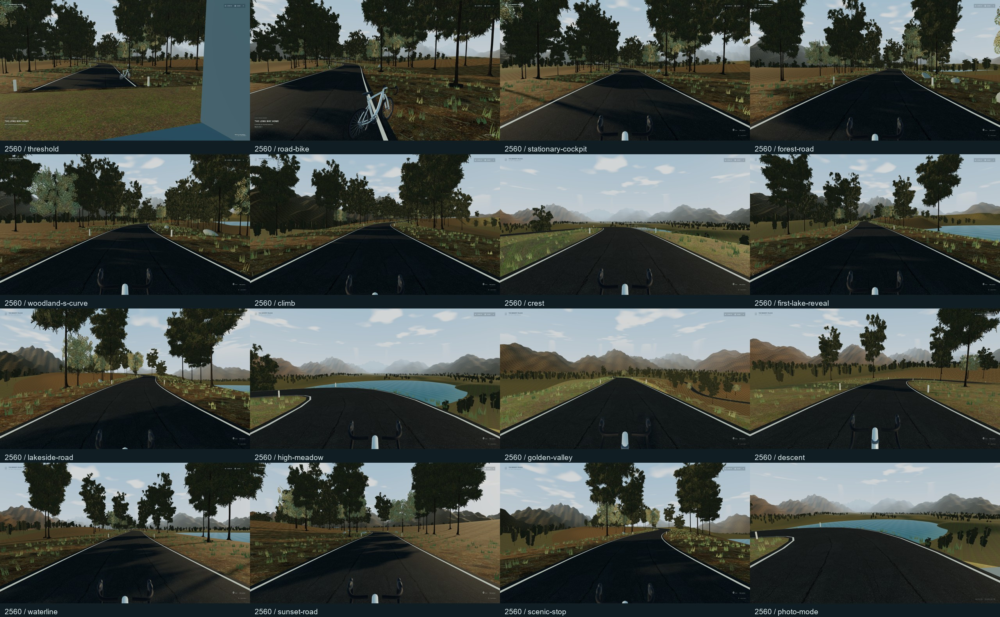
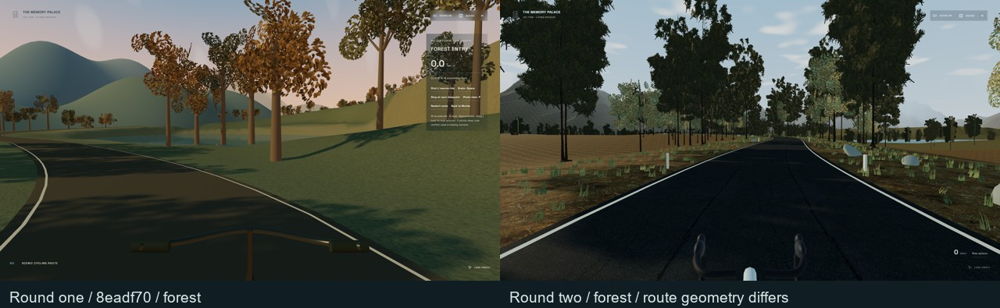

# THE LONG WAY HOME

第二轮从已完成并上传的第一轮 `8eadf70fa124490b4c9ff1e4d34bb19b10f37ee6`（PR #14）派生；不是从旧 PR #13 重新开始。分支：`codex/memory-palace-road-cycling-world`。PR #12、#13、#14 的历史保留，不自动合并或发布。

本轮只深化新目的地 `/cycling`。原馆建筑、篮球场、交互层、音频引擎、歌词、馆标、字体、媒体数据库和 Cinema 的导航所有权不变。原短骑行组件保留在代码历史与源目录中；实际路由调用 `src/worlds/road/Experience.tsx`。

## 路线与操作

一条约 **3.53 km** 的连续铺装路线：林间入口、S 弯、第一次湖面、湖岸、实际爬坡、山脊、高处草甸、山谷、下坡、水线、夕光。不是循环跑道，也不会在章节之间传送。普通连续踩踏与适宜齿比的固定步长物理测试为 **387.2 秒**；有停车、照片和操作的实际浏览器旅程另列，不混用两种计时。

- 从 Worlds 翼进入，先在地面步行，靠近路旁自行车，按 **E** 或 Mount 上车。
- **W / ↑** 踩踏，松开后滑行；**S / ↓ / Space** 渐进制动；**A / D** 小范围转向。
- **Q** 更轻齿比，**E** 更重齿比；**Shift + W** 增加踩踏努力。连续踩踏按钮按真实坡度与速度渐进选择挡位。
- 拖动或原有 Pointer Lock 环顾；**P** 停稳后进入照片，**ESC** 退出当前照片/选项层；保存的是实际画面 PNG，只下载到本机。
- Ride options → Stop at next viewpoint 沿道路前往下一处并平缓制动；三个停点位于湖边、草甸和夕光道路。
- Camera motion reduced 与系统减少动态均降低车身/镜头响应；真实移动、惯性和控制仍然工作。
- Return to the Palace 恢复来源房间；刷新只恢复进度、齿比与舒适选项，以停止、下车状态进入。

自行车为原创无品牌模型：弯把、刹变手柄、把带、性能车架、锥形前叉、下移后上叉、700C / 30 mm 轮胎、54 mm 轮圈、曲柄/飞轮/传动。没有渲染手部。静止时保持正确的 hoods 视线，车轮随真实距离，曲柄随实际踏频。

物理以 90 Hz 固定步长运行，每帧最多六步。牵引、滚阻、风阻、实际坡度与渐进制动力决定速度；55 km/h 安全上限；转向随速度减小，偏离在可见路肩内渐进纠正。正常偏离不会传送；NaN 等真正无效状态才返回最后安全点。

## 音频与隐私

环境音复用现有播放器的 AudioContext，不创建第二个播放引擎。风、胎噪、传动、水、叶声与稀疏鸟声按速度/位置/状态交叉变化；48 齿棘轮的重复速率读取实际轮速，滑行启用，踩踏与停止消退。换挡是短促的真实操作反馈。暂停面板和照片时移动声自然减小。

默认不启动歌曲。原播放器中已有的本机歌曲仍可自愿播放；音乐播放时环境层自动降低，不修改双槽/crossfade/歌词/FFT。静音和原环境音量继续生效；音源只在用户交互解锁后连接，离开释放节点而不关闭共享上下文。

浏览器导入、商业音乐、私有 LRC/HTML/清单仍只留在本机。`build:public` 的五个 personal-media 列表均为空。测试中的骑行音频是这个新场景自己合成的风/传动/棘轮，不是用户歌曲录音。

## 地景与资源预算

- 作者安排的道路、岸线、地形和前中远景，不使用无限随机路线。山脊转弯实际面对下方湖面，局部地形让出视线。
- 160 m 分区，最多六块常驻；远山、远林与湖面提供连续背景。近处实形松树来自明确归属的 CC0 小几何/冠层分布，近树和叶片实例化，远林采用同源冠层图。
- 六张共享 1K 环境纹理。挂载只拥有采样器克隆，退出不销毁缓存原图；分区几何、环境 PMREM 与音效均明确释放。
- 一盏太阳、一盏半球灯；中画质 1024 阴影。没有湖面实时镜面、额外全屏后处理或粒子系统。湖面是天空 Fresnel/法线/日光响应，**不倒映山体**。
- 草木、远山与湖面没有作品交互，跳过它们的大量导航射线；近处道路和自行车保留拾取。这消除了初测中约每秒一次的 166–187 ms CPU 停顿。

素材出处：[Poly Haven Asphalt 02](https://polyhaven.com/a/asphalt_02)、[Pine Tree 01](https://polyhaven.com/a/pine_tree_01)、[Forest Leaves 04](https://polyhaven.com/a/forest_leaves_04)、[Leafy Grass](https://polyhaven.com/a/leafy_grass)，均为 [CC0](https://polyhaven.com/license)。具体转换与归属见 [`public/media/road/SOURCES.md`](../../public/media/road/SOURCES.md)。大型树源模型不随站点发布；公开几何约 316 KB，环境图片约 2.2 MB。

## 验证记录

验收代码为 `bee50dd3b3eb41e2f336f1ead336dc76905776fe`，后续提交只整理验证资料或对应新 DOM 的测试入口。所有失败的早期画面与报告保留在本机输出目录，不能作为最终通过证据。

| 检查 | 实际结果 |
| --- | --- |
| TypeScript / lint / public build | PASS；2388 模块、67 分享路由 / 53 索引路由、旧入口与 404 fallback 保留 |
| 单元测试 | **112 PASS / 22 文件**；原 99 条保留，增加路线/动量/齿比/坡度/停靠/恢复/非破坏存储与音效清理 |
| 完整原生骑行 | **21 PASS**；核心连续行程 407.99 秒，整份原生操作录像 453.44 秒；无距离或相机注入，正常过程不传送 |
| 最终短原生骑行 | **5 PASS**；当前画面下步行、E 上车、W 踩踏、滑行、Q/E、渐进制动、照片、下载、舒适选项、刷新与返回 |
| Cinema / 故障 / 来源返回 | **3 PASS**；骑姿、位置及四元数恢复，显式 NaN 故障恢复后停止，离开清理 road 控制/诊断 |
| 原馆空间、导入、媒体与 Cinema | **12 PASS**；旧 v1 IndexedDB 不丢 blob/收藏/ID，批量图片进入指定房间并刷新保留，五块回廊、一次 ESC、碰撞和真实 FFT |
| 原展品、迷你播放器、歌词交互 | **8 PASS / 1080p + 1440p**；实际注视/收藏/遮挡、原歌词同步与低动态 |
| 原生跨场景音频 | **6 PASS / 两种分辨率**；原创本机 WAV/封面 import、真实 repeat、mini/full 连续性；馆室/球场/骑行使用**一个** AudioContext，刷新保留曲目与封面 |
| 准备与生命周期 | **5 PASS**；冷加载取消、medium/low/high 原生操作与返回、三次重复进出纹理稳定为 22；camera far 恢复 200 |
| 原动效可访问性 | **6 PASS**；原脚本独立重跑，未改预期或旧动效组件。首次并发跑在 live OS reduced 切换瞬间捕获一个尚未清理的 cue，保留为时序敏感记录 |
| 原生公开版活动 | **4 PASS**；没有开发调试导出，公开 Guide、球场原生投篮、骑行实际踩踏/照片/刷新，旧 `/museum` Pointer Lock 与单次 ESC |
| 完整公开浏览器 | **10 PASS / 1 显式 SKIP**；所有主要目的地可由 Guide 到达、旧深链接/后退、无 JS 内容、播放器/图片本机导入和移动降级。生产版不导出开发相机，因此精确坐标碰撞项由开发 QA 和单测覆盖 |
| 私人素材隔离 | public personal-media 五个列表为空，仅 manifest；没有商业音频、LRC、NCM 或私人 TXT；保留 robots 与合法字体/Three 许可证。本机扫描恢复 4/12/40/8/0 的本地库 |

完整旅程中实际采样的合成音频 RMS 为 **0.0024279**；原 AudioContext 实际输出非零，滑行时 wheel-speed freehub=true，重新踩踏后=false。录像是功能证据，不作为硬件帧率测量。无头浏览器没有模拟 GTX 成绩。

原始验证报告见 [verification.json](evidence/verification.json)。空间/导入、原交互和跨场景播放均不含上传请求或运行错误。公开通用浏览器报告另行列出实际跳过项，不把跳过算 PASS。

## 实机性能

Windows、安装版**可见 Edge 148.0.3967.70**、**NVIDIA GTX 1650** / 驱动 `32.0.15.9186`、D3D11，1920×1080、DPR 1、medium。各样本 6–8 秒，逐项确认真实 renderer。使用 Vite 开发构建的原只读诊断；公开生产构建另跑原生功能旅程。采样时没有其他 GPU 验证窗口并发。

| 路段 / 状态 | 平均 FPS | P95 / 最大帧间隔 |
| --- | ---: | ---: |
| Trailhead 静止 | 111.9 | 14.0 / 34.7 ms |
| 密林静止 / 实际踩踏 / 滑行 | 119.5 / 111.0 / 114.9 | 13.9–14.0 / 27.8–34.7 ms |
| 爬坡 | 135.6 | 13.8 / 27.8 ms |
| 第一次湖面 / 湖岸 | 142.5 / 141.8 | 7.0–7.1 / 27.8–34.7 ms |
| 高处草甸 / 山谷 | 139.5 / 142.0 | 7.2 / 27.8，7.1 / 27.7 ms |
| 下坡静止 / 实际踩踏 / 滑行 | 142.3 / 141.0 / 142.7 | 7.1 / 34.7、**62.5**、27.8 ms |
| 退出后的 Worlds 翼 | 144.0 | 7.0 / 13.9 ms |

骑行样本主绘制约 49–80 calls、35.7 万–219.9 万 triangles、17–22 GPU textures、2 lights；移动峰值 107 calls。材质图像估算约 35.6 MiB，不是总 VRAM。renderer.info 不合计阴影/PMREM 全部通道，没有 GPU timer query。

数据：[最终采样](evidence/performance-final.json)、[修复拾取后的前次采样](evidence/performance-two.json)、[初测](evidence/performance-one.json)。最终采样来源 `52057bd` 的道路渲染；之后骑行物理与地景未变，只接上新门户照片、补测试/资料。前次仍有 **90.4 ms** 的移动峰值，最终有 **62.5 ms**，不宣称消除所有停顿。前一轮已记录的户外→原玻璃馆冷编译约 **3.3 秒**也仍属已知问题，本轮没有重写原馆材质。

未测：1440p 性能、DPR 2、30 分钟热稳态、实体移动设备。1440p 只做布局/静止画面与原交互验证。

## 真实截图与运动片段

两种分辨率各 **16** 个真实视角，保持完整构图，停稳后检查；静态分镜通过有效保存位置布置，逐项验证实际距离，不能冒充连续行程。32 张原分辨率 WebP 在 evidence 中。已实际查看两张联系表、单独的重要画面及原生录像抽帧，修正道路/远山绕序、湖面遮挡、草叶侵入路面、远林悬空、林荫馆标对比度与重复 CPU 拾取峰值。

对比来自两次真实运行，同为 1080p / medium；两条路线几何已经不同，**不声称它们是同一相机坐标**。原馆的同机位资料和保留检查继续见第一轮文档。

连续原生行程视频剪出 [14 段操作片段](evidence/motion-index.json)与[合并预览](evidence/native-motion.mp4)：跨阈值、上车、加速、巡航、换挡、实际滑行声、爬坡、山脊、下坡、制动、转弯、停靠、照片、返回。只有 [actual-freehub](evidence/clips/actual-freehub.mp4) 混入当时原 AudioContext 捕获的声音，其余片段为静音；不加音乐或伪造环境声。完整 7 分 33 秒原始视频保存在本机输出，避免重复提交 61 MB 原片。

完整视频来源 `5809a1f`，其后仅修草叶、水波、树根附着、馆标对比度与门户照片；路线、惯性、原音频/歌词/媒体管线未变。最终代码另有[原生换挡片段](evidence/clips/final-native-gears.mp4)与短完整骑行检查。不用旧视频替代最终静态画面。

这是原创建模与有明确 CC0 来源的混合地景。远林是图像冠层、草地和山体仍有简化，不把它称为扫描写实世界。湖面没有山体反射；未渲染手、出鞍摇车、车辆/NPC 或天气。

## 主要文件与边界

| 文件 | 改动 |
| --- | --- |
| `src/worlds/road/route.ts`、`physics.ts` | 连续地形/道路、坡度、停点、齿比与真实惯性 |
| `RoadBike.tsx`、`Landscape.tsx`、`Environment.tsx`、`textures.ts` | 原创公路车、分区地景、同方向太阳/天空、共享纹理归属 |
| `Experience.tsx`、`state.ts`、`Hud.tsx`、`road.css` | 步行/骑行、头部视线、照片、安全停止、非破坏存储、Cinema 暂存、轻量操作 |
| `audio.ts` | 原 AudioContext 内的有限环境/传动节点，真实轮速棘轮 |
| `src/worlds/WorldsBoundary.tsx`、`OutdoorEnvironment.tsx`、`worldConfig.ts`、`preload.ts` | 只为既有 cycling ID 选择新场景/环境/初始视线与准备入口 |
| `src/world/Player.tsx`、`src/worlds/ActivityHud.tsx` | 标记的少量插入，骑行接管时读取原生头部视角，其他房间继续原行为 |
| `tests/road-*.test.ts`、`scripts/*road*.mjs` | 数据恢复、惯性、真实坡度、音效清理、完整原生旅程、静态截图、实机采样 |

没有新数据库版本，v1 旧骑行存储只读迁移到 v2；保留旧键与所有 IndexedDB 收藏。Cinema 只保存同一次访问的临时骑姿，速度安全归零；不在刷新后自动上车。StrictMode 重播不会重复消费快照，原 Player 恢复角度后才重新建立头部参考。

## 复现

`npm ci` → `npm run lint` → `npm test` → `npm run build:public`。

开发 `npm run dev -- --port 5190 --strictPort`；公开构建 `npm run preview -- --port 5191 --strictPort`。本机路径扫描仅用于本机开发；公开验证不需要个人素材。

各脚本支持 `PALACE_URL`、`PALACE_ARTIFACTS`。`check-road-journey.mjs` 是完整原生骑行录像，`capture-road-cycling.mjs` 是有效存储位置的静态分镜，`measure-road-cycling.mjs` 是可见安装版 Edge 的实际显卡测量。三种证据各有用途，不用截图脚本或无头录像计时冒充 GTX 1650 性能。

本机可用：开发 `http://127.0.0.1:5190/cycling/`，公开构建 `http://127.0.0.1:5191/cycling/`。**未部署 GitHub Pages**，不编造分支公网预览。原 PR #14 是第一轮恢复点；本轮独立草稿 PR 以第一轮分支为 base，主站入口与 main 不变。

## 独立提交

| SHA | 内容 |
| --- | --- |
| `d2483f9` | 作者路线、湖谷、真实动量与齿比模型 |
| `ba2505f` | 原创弯把公路车与共享 CC0 采样器 |
| `278ca92` | 连续铺装地景、六块有界分区 |
| `00b5d1f` | 步行/上车、踏频/棘轮、舒适选项、来源返回 |
| `15e3433` | 树冠、山谷与有限天空湖面响应 |
| `eb4e4a1` | Cinema 骑姿、真实棘轮音频、实际停靠测试 |
| `670d7c7` | 可见湖面的真实山脊与完整行程计时 |
| `589f43b` | 去掉非交互植被的巨大射线拾取开销 |
| `dd4d5f3` | 目的地命名、原生旅程/录像、视觉/显卡 QA |
| `5809a1f` | StrictMode 与原 Player 返回顺序下的骑姿/头部视线恢复 |
| `95a506a` | 停稳时的草叶差异、水波与林间馆标对比度 |
| `32e7c8e` | 草叶不侵入铺装面、远林附着实际地形三角形 |
| `52057bd` | 保留三档资源/取消/跨场景单 AudioContext 回归 |
| `04134f2`、`bee50dd` | 实际照片与门户连接，清晰原生换挡录像 |
| `20010f4` | 通用公开浏览器断言改为实际可见的轻量骑行标题 |

后续文档/证据提交只整理本文件、README、真实截图/片段与匿名验证，不改场景。各步骤可单独撤销；不 reset、force push 或改写先前 PR。
