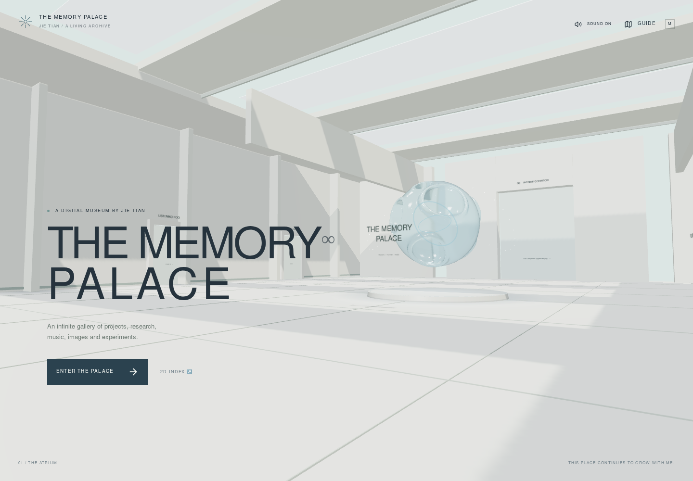
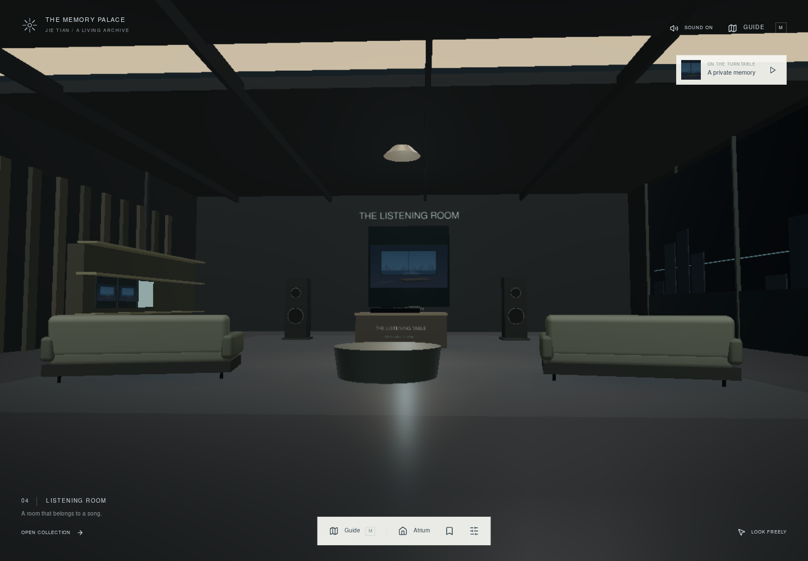
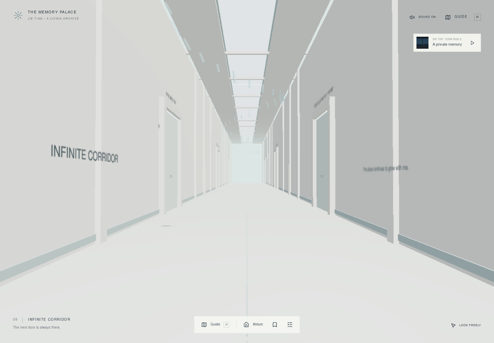
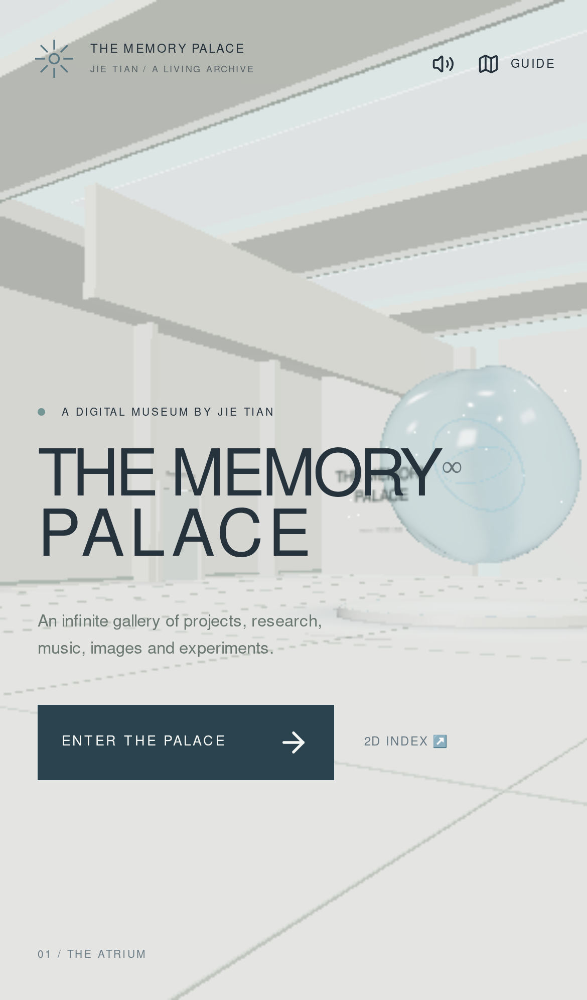

# Memory Palace — verification record

验证日期：2026-10-02。验证对象为本分支的生产构建，使用本地 Vite preview 和 Chromium。所有导入测试使用人工创建的测试文件，不含真实私人收藏。

| 检查                | 结果                                                    |
| ------------------- | ------------------------------------------------------- |
| `npm test`          | 5 个测试文件，41 项通过                                 |
| `npm run lint`      | 通过                                                    |
| `npm run build`     | TypeScript 与生产打包通过                               |
| `npm run test:hero` | 原有模型、模块与降级检查通过                            |
| 生产浏览器          | 10 项通过，退出码 0                                     |
| 静态部署            | 42 个路径、31 个本地资源、4 个旧页面、404 fallback 通过 |
| 浏览器错误          | 控制台、运行时、HTTP ≥400 均为 0                        |
| 自动外部请求        | 0；字体、环境、内容与展示素材均本地提供                 |

浏览器验证覆盖：无 JavaScript 语义内容、真实中档玻璃核心首次渲染、2D 搜索与作品深链接、八个主展馆、独立作品房间、浏览器返回、Guide、书签、设置及手机无横向溢出。音乐验证包含本地导入、metadata 编辑、封面导入、网易云链接、播放进度持久化、刷新后不自动播放及跨 2D 栏目继续。图像验证包含本地保存、原图下载链接与原始文件名、原比例全屏、嵌套 Tab/Shift+Tab/ESC 与 Wallpaper Cinema。

补充的 `npm run test:audio-travel` 实际在生产 3D 场景播放 Palace Study，然后通过 Guide 从 Listening Room → Project Gallery → Research Hall。3 项检查通过：同一原生 Audio 元素保持、没有 pause／ended／emptied／abort 事件，播放位置从 1.24 秒增长到 5.39、8.58 秒。此检查通过 Chromium CDP 观察真实音频对象，不依赖生产应用的调试状态。

生产构建不暴露开发用相机对象，因此精确坐标／碰撞／长廊驻留区段的浏览器断言记为 **SKIP**。开发浏览器此前实际检查 WASD 位移、边界及五个驻留区段；当前六项空间单元测试覆盖确定性种子、远距离驻留数量、内容房间解析、家具碰撞和触控绕障。

云端使用 **SwiftShader 软件渲染**。其音乐室帧耗中位数约 250 ms、p95 约 483 ms，仅记录测试环境的限制；无法证明 GTX 1650 的 45 FPS 或现代电脑的 60 FPS。目标机器仍需在 1080p 下实际遍历各展馆测量。自动降档、移动端低档、局部加载与卸载已经实现，性能目标尚未获得实机验收。

## 实际截图

### 主大厅，Medium

### Listening Room

### Infinite Corridor

### 手机入口，Low / Tour

复现方式见 [README 的生产验证命令](../README.md#生产环境浏览器验证)。完整原始报告和其余截图另存于交付的 QA 产物包。
